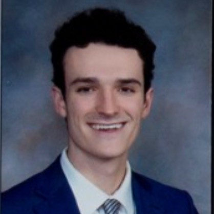

# John Duffy

john.duffy409@gmail.com

http://www.linkedin.com/in/john-duffy-394960b0

# Summary

As a self-motivated Honors Student from the University of Washington, I am ready to put in the work and effort needed to excell in this position. 

# Work Experience (only last 10 years)

## University of Washington (Seattle, WA)

* Major: Geography: Data Science  Minor: Informatics*

** Honors Student ** (Sep. 2020 - June 2024)

>As an honors student at the University of Washington, I conducted an independent research study with a faculty mentor. 

- Worked with a faculty mentor on a **research project**.
- Departmental GPA of 3.76
- Overall GPA of 3.67

## Innovative Home Renovations (Seattle, WA)

** Construction Assistant (Gopher)** (June 2022 - October 2023)

>Worked with various contractors to keep build schedules on time and on track

- Worked here for 2 summers in 2022 and 2023.
- Gained valuable experience from many professionals
- Worked in an office setting and a construction setting

## Piatti Italian Ristorante (Seattle, WA)

Bus Boy

- This job taught me how to work fast and quick
- Improved my people skills

[University 1]: http://www.univ1.edu
[University 2]: http://www.univ2.edu
[University 3]: http://www.univ3.edu